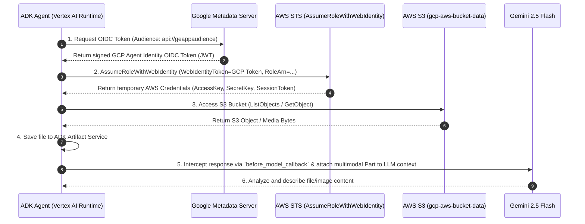

# Agent Identity Token Exchange: GCP Agent Engine to AWS S3

This repository demonstrates how an agent built with the **Google Agent Development Kit (ADK)** and deployed to **Gemini Enterprise Agent Runtime** can use **GCP Agent Identity** to securely authenticate across cloud providers.

Specifically, it illustrates a cross-cloud token exchange flow:
1. The agent retrieves its short-lived **GCP Agent Identity OIDC ID Token** from the Google Metadata Server. This token is cryptographically bound to the [unique SPIFFE identity and an X.509 certificate](https://docs.cloud.google.com/iam/docs/agent-identity-overview#how-it-works).
2. The agent exchanges this GCP OIDC ID Token with **AWS Security Token Service (STS)** (`AssumeRoleWithWebIdentity`) for temporary AWS credentials.
3. The agent uses the temporary AWS credentials to securely access and analyze files (PDFs, images, etc.) stored in an access-controlled **AWS S3 Bucket**.

---

## Architecture & Workflow



---

## Repository Structure

```
.
├── deploy.py                  # Script to deploy/update the agent to Vertex AI Agent Runtime
├── requirements.txt           # Python dependencies for the agent container
└── token_agent/
    ├── __init__.py            # Module entry point exporting `app`
    ├── agent.py               # ADK Root Agent, system prompt, and `before_model_modifier` callback
    ├── identity.py            # Utility functions for SPIFFE fingerprinting & Metadata OIDC token fetch
    └── tools/
        └── aws/
            ├── __init__.py    # Exposes AWS tools
            └── aws_files.py   # STS Token Exchange, S3 Bucket listing, and file retrieval tools
```

---

## Environment Variables

Configure the following environment variables prior to running `deploy.py`:

| Variable | Description | Example |
| :--- | :--- | :--- |
| `GOOGLE_CLOUD_PROJECT` | GCP Project ID | `projectid` |
| `GOOGLE_CLOUD_LOCATION` | GCP Region | `us-central1` |
| `GOOGLE_CLOUD_PROJECT_NUMBER` | GCP Project Number | `123456789` |
| `ORGANIZATION_ID` | GCP Organization ID (if applicable) | `987654321` |
| `STAGING_BUCKET` | GCS Bucket for staging agent artifacts | `gs://projectidstaging` |
| `AUDIENCE` | OIDC Audience matching the AWS Identity Provider Client ID | `api://geappaudience` |
| `AWS_ROLE_ARN` | IAM Role ARN in AWS for Web Identity Federation | `arn:aws:iam::1122334455:role/gcp_aws_agent_identity_role` |
| `AWS_BUCKET` | AWS S3 Bucket Name | `gcp-aws-bucket-data` |

---

## AWS Setup & Configuration Guide

To enable GCP Agent Identity to authenticate to AWS via Workload Identity Federation, complete the following configuration steps in AWS IAM:

### Step 1: Create an OpenID Connect (OIDC) Identity Provider in AWS

1. Navigate to **IAM > Identity Providers > Add Provider** in the AWS Management Console.
2. Select **OpenID Connect**.
3. **Provider URL**:
   * Use "issuer" from your .`well-known/openid-configuration` endpoint:
     ```
     https://sts.googleapis.com/v1/organizations/ORGANIZATION_ID/locations/global/workloadIdentityPools/agents.global.org-ORGANIZATION_ID.system.id.goog
     ```
     *(Replace `ORGANIZATION_ID` with your GCP Organization ID, e.g., `987654321`)*
4. **Audience**: Specify your configured `$AUDIENCE` (e.g., `api://geappaudience`).
---

### Step 2: Create an AWS IAM Role with Web Identity Trust Policy

1. Navigate to **IAM > Roles** in the AWS Management Console.

2. Create an IAM Role configured for **Web Identity** federation and selecting the **Web Identity Provider** from Step 1 above.

### Step 3: Attach a S3 Access Policy to the IAM Role

Attach an IAM inline or managed policy to the role. In this example, we're granting list and read permissions on the target S3 bucket:

#### Example S3 Permissions Policy:
```json
{
  "Version": "2012-10-17",
  "Statement": [
    {
      "Sid": "listObjects",
      "Effect": "Allow",
      "Action": [
        "s3:ListBucket"
      ],
      "Resource": [
        "arn:aws:s3:::gcp-aws-bucket-data"
      ]
    },
    {
      "Sid": "getObjects",
      "Effect": "Allow",
      "Action": [
        "s3:GetObject"
      ],
      "Resource": [
        "arn:aws:s3:::gcp-aws-bucket-data/*"
      ]
    }
  ]
}
```

---

## Deployment to Vertex AI Agent Runtime

1. **Set Up Python Virtual Environment**:
   ```bash
   python -m venv venvs
   source venvs/bin/activate
   pip install -r requirements.txt
   ```

2. **Set GCP Environment Variables**:
   ```bash
   export GOOGLE_CLOUD_PROJECT=
   export GOOGLE_CLOUD_LOCATION=
   export GOOGLE_CLOUD_PROJECT_NUMBER=
   export ORGANIZATION_ID=
   export STAGING_BUCKET=
   export AUDIENCE=
   export AWS_ROLE_ARN=
   export AWS_BUCKET=
   ```

3. **Deploy Agent**:
   ```bash
   python deploy.py
   ```

---

## Usage Examples

Once deployed, the agent accepts natural language prompts to perform identity verification and S3 data analysis:

* **Retrieve Identity**: *"What is your Agent Identity token?"*
* **List Files**: *"List the files available in the AWS S3 bucket."*
* **Describe Image**: *"Tell me about the artist in the 5th image in the bucket."*
* **Summarize PDF**: *"Summarize the contents of the 3rd PDF document."*